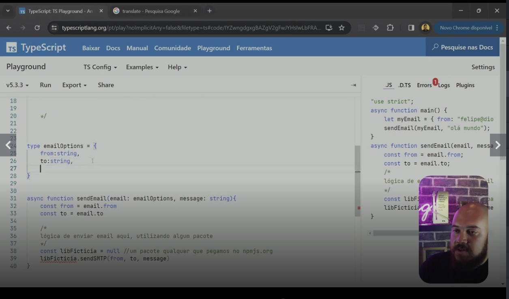
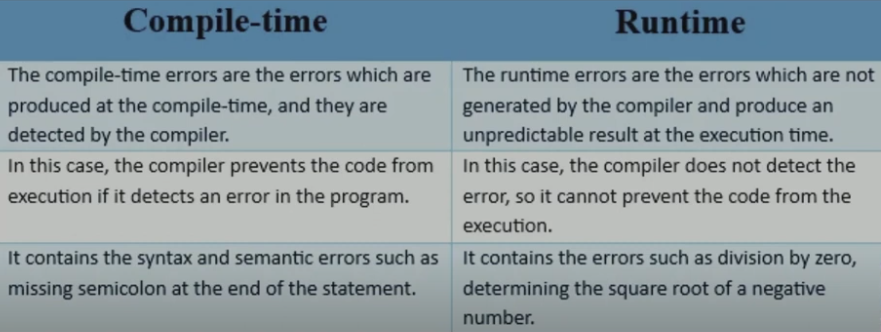
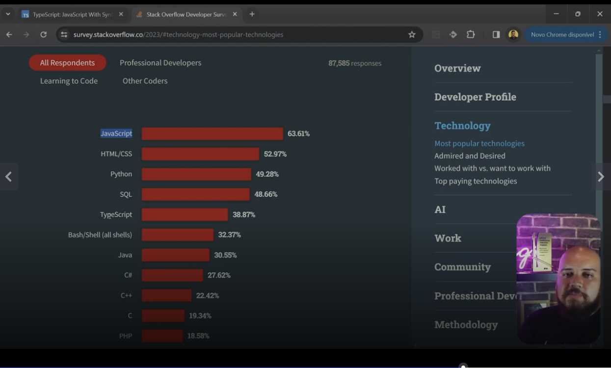
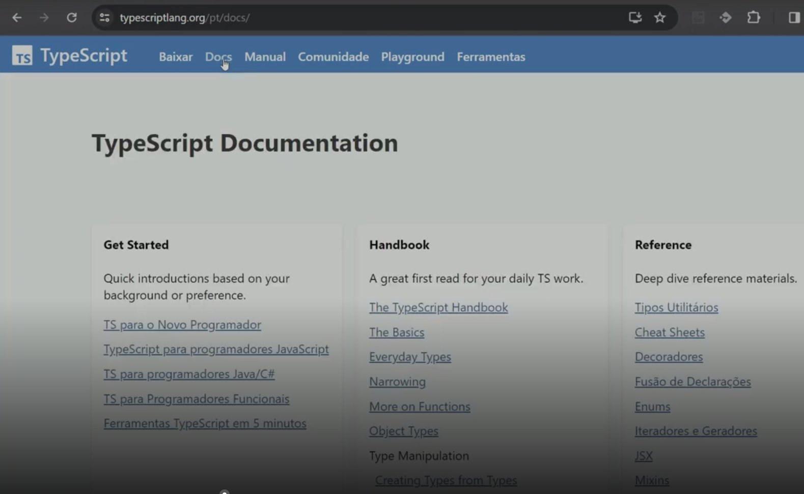
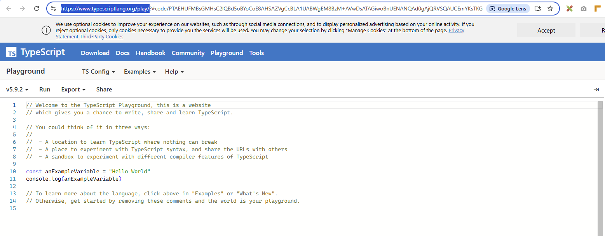
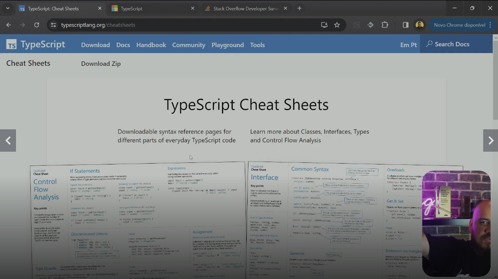
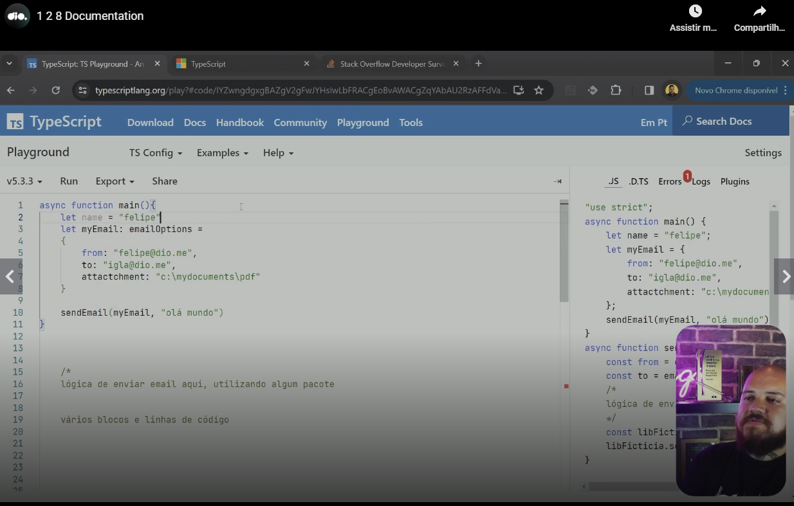

# Introduction

See in this image that defines a specific class format you do not need a class in TypeScript. You can create a type:

# Comparing runtime against compile time errors

A comment: although TypeScript transpile a code and not compile it, we can think in things in compile time (in transpilation time), problems that JavaaScript can not detect.

# Interesting StackOverflow survey (2023)

# Typescript documentation in the official website

Interesting. Please access [this link](https://www.typescriptlang.org/docs/).

# TypeScript playground

[Link](https://www.typescriptlang.org/play/)

# TypeScript cheat sheets

[Link](https://www.typescriptlang.org/cheatsheets/)

# Using without specifying a type

You can. You do not need to specify 'any' as example. Please see the property 'name' in the next image.

# Slides of the classes

[link](https://hermes.dio.me/files/assets/5f9d9e9d-ea07-43ed-97ee-3d3b5a113f0a.pptx)

# Regpository related of the classes

[link](https://github.com/digitalinnovationone/formacao-nodejs/tree/main/10-typescript)
